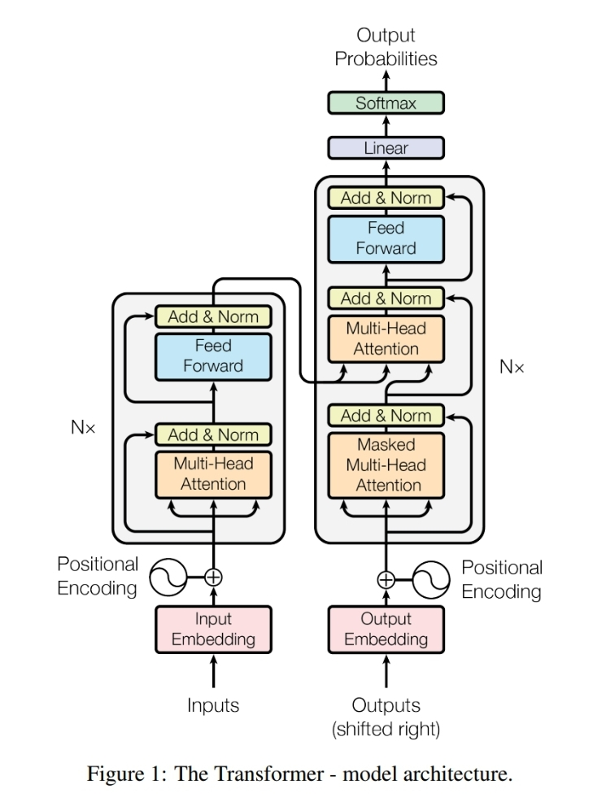

# Introduction

Transformers is a deep learning architecture introduced in the paper "Attention Is All You Need", which is written by Google Research team. This architecture is the core of various improvements in both Natural Language Processing and Computer Vision.

# Overview

In the original paper, Transformers include two main components. The first component consists of 6 encoders stacked together. And the second includes 6 decoders.



# Architecture

## Embedding layer


Input will go through an embedding layer first in both encoder and decoder, this layer will convert each token into a vector with size `d_embedding`, in the training process, this layer will be also trained to learn the representation of each token through backpropagation algorithm.

## Position encoding

Assume input includes 7 tokens like above image, we have position encoding will be a matrix with size 7 * `d_embedding`  in which, each row will be encoding of token's position.

$$
PE(pos, 2i) = sin(pos / 10000^{2i/d_{embedding}})
$$

$$
PE(pos, 2i+1) = cos(pos/10000^{2i/d_{embedding}})
$$

`i` takes a integer value from `0` to `d_embedding / 2`

For example, with `pos = 0` , `d_embedding = 512` , we have:

$$
PE(0, 0) = sin(0 / 10000^0) = 0 \\
PE(0, 1) = cos (0 / 10000^0) = 1 \\
PE(0, 2) = sin(0 / 10000^{2/512}) = 0 \\
...
$$

The encoded vector for row 0 will be `[0, 1, 0, 1, …, 0, 1]`

## Encoder layer


Encoder includes Multi-Head Attention Layer (in the original paper it is 8 heads), after that is a Add and Norm Layer which contain a residual connection and a normalization function. After is a Position-wise Fully Connected Feed-forward Network.

## Decoder layer

Decoder is quite same as encoder except that it contain a Masked-Multi-Head Attention Layer at the beginning and a Multi-Head Attention Layer which take the output of encoder as input. The Masked-Multi-Head Attention Layer is used to prevent the decoder from seeing the future tokens.


## Multi-Head Attention (MHA)


This is the main part of the Transformer architecture. It is a combination of multiple attention layers. Each attention layer is a scaled dot-product attention layer. The output of each attention layer is then concatenated and passed through a linear layer. The output of the linear layer will present the effect of other tokens in the sequence to the current token.

# How it works

Now, we need to deep dive in how this architecture actually work in training and inference phase. The architecture in the originial paper is optimized for machine translation task, so, I assume the task is translate sentences from English to Vietnamese.

## Training phase

For a training sample with input is “I am mastersunflowers” and the expected output is “Toi la bac thay hoa huong duong”. For simplicity, assume tokenizer will tokenize sentence as follow: “<SOS>”,  “I",  “am",  “master", “sun", “flowers", “<EOS>” and “<SOS>”, “Toi", “la", “bac", “thay", “hoa", “huong”, “duong", “<EOS>”.

### What happens in the encoder layer?

The input, as introduced at Embedding Layer part, will be embedding into a `7 *d_embedding` matrix, then the input also through Position Encoding layer, which produce also a `7* d_embedding` matrix, each row will contains a value that can represent the postion of input token.

I will annotate the input is `X`, the embedding `X` is `X_e`, the postion is `X_p`, so, the matrix to push into first sub-layer of encoder is

$$
X_t = X_e + X_p
$$

And then we have:

$$
K = X_t * W_k
$$

$$
Q = X_t * W_q
$$

$$
V = X_t * W_v
$$

`W_k` is a matrix with dimension `d_embedding * d_k`

`W_q` is a matrix with dimension `d_embedding * d_q`

`W_v` is a matrix with dimension `d_embedding * d_v`

`d_k` need to equal `d_q`

In the paper, because of residual connection, the output of Multi-Head Attention Layer must have equal dimension of the `X_t` which have `num_tokens * d_embedding` so, we have `d_q = d_k = d_v = d_embedding / num_heads` .

For more accurate and shortage, I will call the dimension of intermediate matrix in the encoder is `d_model` because `d_model` can different than `d_embedding` among architectures but in this case `d_model` need to equal `d_embedding` because of residual connection.

Each head in Multi-Heads Attention Layer have the same functionality, which will forward input `(K, Q, V)` as:

$$
    Attention(K, Q, V) = softmax(\frac{QK^T}{\sqrt{d_k}})V
$$

The output of this shoud be a matrix with `num_tokens * d_v`, apply input to this we will have `7 * (d_model / num_heads)`, assume `d_model = d_embedding = 512` and `num_heads = 8` as in the original paper, it should be `7 * 64` matrix.

The output of 8 heads will be concatenated across row axis, so the output of Multi-Head Attention Layer will be `7 * 512`.

Then this output will be added with `X_t` matrix (which also have dimension as `7 * 512`) to create a residual connection, and then the result will be normalized using Layer Normalization (which normalize range of feature values across layer).

The result of previous step will go through a Pointwise Feed Forward Layer, this sub-layer include two layers (in the original paper) with parameters matrix `512 * 2048` and `2048 * 512` and ReLU activation in the first layer. We can see this clearly in [HuggingFace's transformers implementation](https://github.com/huggingface/transformers/blob/ec7afad60909dd97d998c1f14681812d69a15728/src/transformers/models/ctrl/modeling_ctrl.py)

```python
def point_wise_feed_forward_network(d_model_size, dff):
    return nn.Sequential(nn.Linear(d_model_size, dff), nn.ReLU(), nn.Linear(dff, d_model_size))
```

Then the result of this layer will be addes with `X_t` and normalized.

Be noticed that, there are 6 encoders, the output of previous encoder is the input of the following encoder. The output of the last encoder will be a matrix represent the encoding of input. This will be an input of decoder, which will be described in the rest of this post.
I will called the final output of encoder is `X_e`.

### What happens in decoder?

At the beginning, input of decoder is also go through embedding layer and position encoding layer, the results will be added to make `X_t` matrix. Then, the output will feed into Masked Multi-Head Attention Layer. This layer is also like Multi-Head Attention Layer except that there is additional step when calculate
$$
    Attention(K, Q, V) = softmax(\frac{QK^T}{\sqrt{d_k}})V
$$: before multiple by `V`, there is a mask matrix `M` which is a lower triangle matrix. The result of $$M * softmax(\frac{QK^T}{\sqrt{d_k}})$$ will be multiple by `V`. This ensure that the output of decoder will not be affected by the future tokens.
Then, the output of Masked Multi-Head Attention Layer will be added with `X_t` and normalized to produce `X_mmha`. The result take as the input of Multi-Head Attention Layer. At this point we will have:

$$
    Q = W_q * X_{mmha}
$$

$$
    K = W_k * X_e
$$

$$
    V = W_v * X_e
$$

These matrices will be pass through the Multi-Head-Attention Layer (which also called cross_attention to distinguish from self_attention in the encoder). The remain steps are similar to the encoder, the output of this layer will be added with `X_mmha` and normalized. The result will be the input of Point-Wise Feed Forward Network. The output of this layer will be added with the result of Multi-Head Attention Layer and normalized.
At the end, the output of decoder will be pass through a Linear layer, which map the output to the vocabulary size and the activation function is softmax. The output of this layer will represent the probability distribution of each word for all the position in the target text.

### How to calculate the loss?

The loss function is cross entropy loss. The target is the one-hot vector of the target text. The loss will be calculated by calculate the distance between two distribution:

$$
    L = - \sum_{i=1}^{n} y_i \log(\hat{y}_i)
$$


where $y_i$ is the target distribution and $\hat{y}_i$ is the predicted distribution. The loss will be calculated for each word in the target text and then averaged.

## Inference phase

The inference phase still have steps similar to the training phase in the encoder part. The difference is that there isn't a target text, so we will use the output of the previous time step as the input of the current time step. At the begin, the input of the decoder is a start token. The process will be repeated until the model predict an end token or the generated text reach the max length.

Be noted that, we only use the final last hidden state of the decoder as the input of the linear layer to predict the next token. The other hidden states are not used. One more important difference is that in the inference phase, we do not need to mask the future tokens. It means that Masked-Multi-Head Attention Layer will have affect like Multi-Head Attention Layer.


