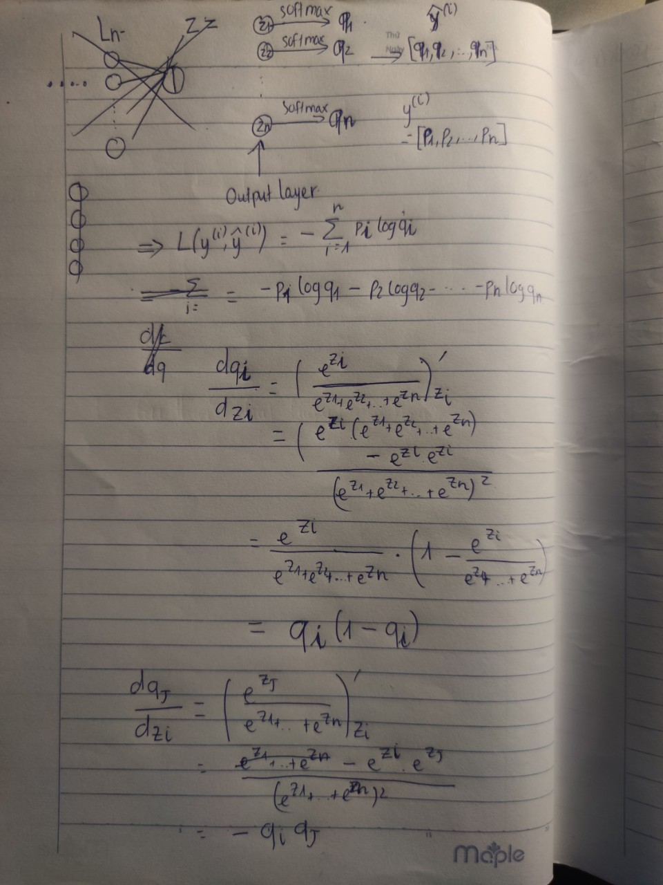
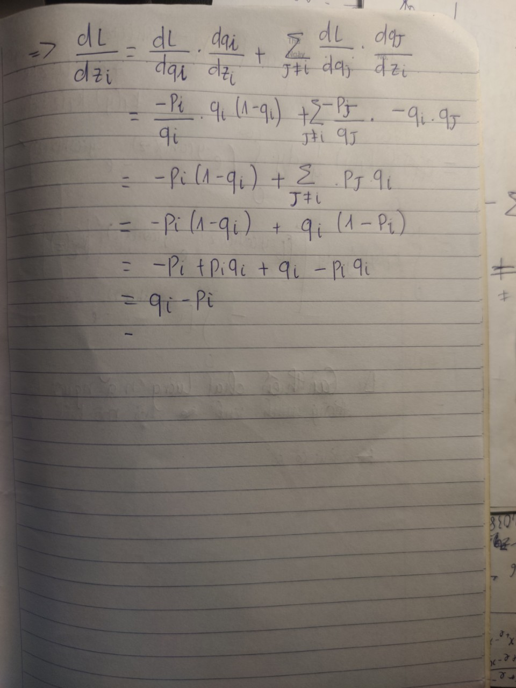

# Giới thiệu

Các bài toán phân loại nhiều nhãn thường sẽ được đưa về dạng phân bố xác suất, nghĩa là đối với mỗi điểm dữ liệu bất kỳ sẽ có phân bố xác suất điểm dữ liệu đó thuộc về một nhãn nào đó. Cụ thể, giả sử bài toán phân loại có $3$ nhãn, khi đó kết quả dự đoán đối với một điểm dữ liệu có thể là $[0.75, 0.2, 0.05]$, nghĩa là xác suất điểm dữ liệu thuộc class1 là 0.75, class2 là 0.2 và class3 là 0.05. Giả sử, thực tế điểm dữ liệu đó thuộc class1, ta mong đợi rằng kết quả dự đoán sẽ là $[1, 0, 0]$. Khi đó hàm mất mát (đo sự sai lệch giữa kết quả dự đoán và kết quả thực tế) có thể được tính bằng khoảng cách giữa 2 phân phối xác suất này:
$$
    D_{KL}(P||Q) = -\sum_{i \in \Omega}p_i\log_2(\frac{q_i}{p_i})
$$
Áp dụng công thức đối với trường hợp trên ta được
$$
D_{KL}(\textbf{y}^{(i)}||\hat{\textbf{y}}^{(i)}) = -\sum_{j=1}^{3}y_j^{(i)}\log_2(\frac{\hat{y}_j^{(i)}}{y_j^{(i)}})\\
=-1\times \log_2\frac{0.75}{1}-0-0 = -\log_20.75\approx0.415
$$
Có thể chứng minh được khoảng cách Kullback-Leibler - relative entropy không âm và chỉ bằng 0 khi 2 phân phối xác suất là giống nhau. Tuy nhiên khoảng cách Kullback-Leibler không phải là khoảng cách thực sự vì không có tính đối xứng $D_{KL}(P||Q) \ne D_{KL}(Q||P)$ và 2 khoảng cách này chỉ bằng nhau khi $D_{KL}(P||Q) =  D_{KL}(Q||P) = 0$ nghĩa là $P=Q$.

**? Tại sao không sử dụng khoảng cách Kullback-Leibler để làm hàm mất mát**

Hàm Kullback-Leiber khó tính gradient, phục vụ cho quá trình lan truyền ngược.

# Cross-entropy

Dựa trên hàm Kullback-Leiber, ta có thể xây dựng một hàm mất mát dễ tính toán hơn đó là hàm cross-entropy:
$$
H(P, Q) = -\sum_{i \in \Omega}p_i\log(q_i)
$$
Có thể biến đổi công thức này theo hàm Kullback-Leibler:
$$
H(P, Q) = -\sum_{i \in \Omega}p_i\log(q_i) = -\log 2\sum p_i\log_2(q_i) \\= -\log 2 (\sum p_i\log_2(\frac{q_i}{p_i}) + \sum p_i\log_2 p_i) = \log_2(D_{KL}(P||Q) + H(P))
$$
Nếu như H(P) là hằng số, thì việc ta tối ưu hàm cross-entropy cũng sẽ tối ưu hàm Kullback-Leibler, tức là giảm sự sai lệch của phân phối P so với phân phối Q
Cross-entropy là một hàm mất mát, đo sự sai khác giữa kết quả dự đoán và kết quả thực tế. Chủ yếu được sử dụng trong cái bài toán phân loại nhiều nhãn (multi-label)

# Đạo hàm

