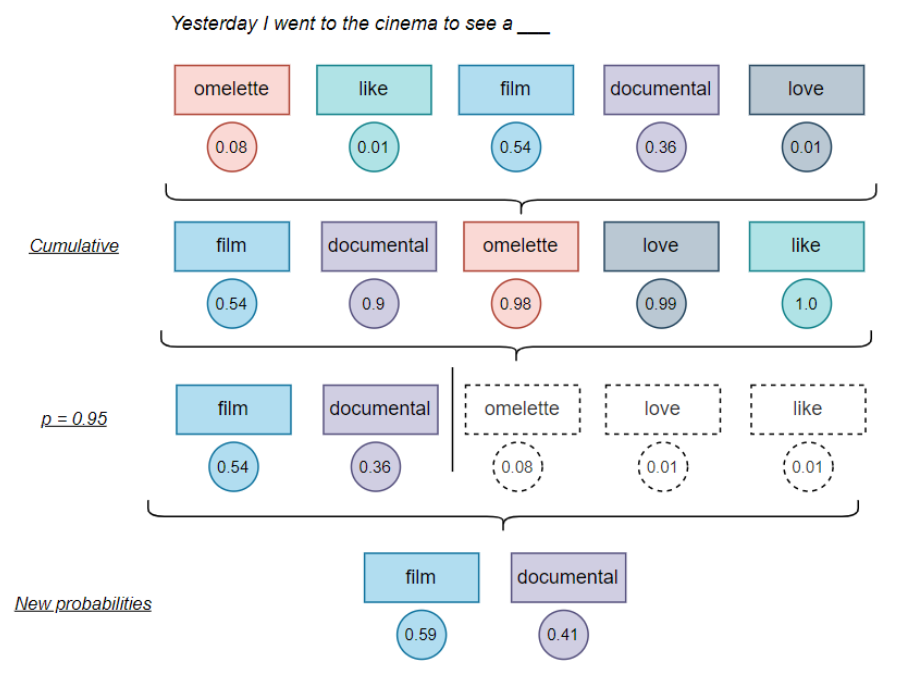

# Temparature

Kiểm soát tính ngẫu nhiên của văn bản sinh ra (kiểm soát phân bố xác suất xuất hiện của từ ở một vị trí cụ thể). Thực hiện bằng cách điều chỉnh hàm softmax ở tầng cuối cùng của mô hình:

**Softmax với Temperature=1**
$$
p(x_i) = \frac{e^{x_i}}{\sum\limits_{j=1}^V e^{x_j}}
$$
Trong đó $p(x_i)$ là xác suất của từ mà logit thứ $i$ đại diện (logit là dự đoán chưa được chuẩn hóa của mô hình bởi việc diễn giải giá trị của chúng là khó khăn e.g. giá trị của lớp cuối cùng trong một mạng neural trước các hàm phi tuyến tính (softmax, sigmoid) là logit: sau khi sử dụng hàm softmax, ta có thể hiểu bộ số đó là một phân bố xác suất $0 \le p(x_i) \le
 1$ và $\sum p(x_i) = 1$).  

**Softmax với Temperature != 1**
$$
p(x_i) = \frac{e^{\frac{x_i}{T}}}{\sum\limits_{j=1}^V e^{\frac{x_j}{T}}}
$$

Lấy phân bố xác suất khi T=1 làm chuẩn thì khi T tiến đến 0 làm cho các xác suất cao càng cao hơn, ngược lại khi T lớn hơn 1 và tăng thì khoảng cách giữa các xác suất ngắn lại, khiến nhiều từ có khả năng được chọn hơn. Đặc biệt, khi T=0, chỉ có những logit cao nhất mới cho xác suất khác 0, nghĩa là nếu chỉ có một logit cao nhất thì xác suất $p(x_i) = 1$ (tất định), nghĩa là với cùng input thì mô hình luôn dự đoán từ tương ứng với logit cho $p(x_i)=1$, trường hợp có $k$ logit trong $n$ logits có cùng giá trị cao nhất thì $p(x_1)=p(x_2) = ... = p(x_k) = \frac{1}{k}$ và $p(x_{k+1}) = p(x_{k+2}) = ... = p(x_n) = 0$.

# Top_p
Tư tưởng là bỏ qua những logit cho ra xác xuất thấp

- Sắp xếp giá trị $p(x_i)$ theo chiều giảm dần
- Cộng tích lũy $p(x_i)$ sau khi chạm ngưỡng $P$ thì dừng lại, giả sử khi đến $p(x_k)$ thì $\sum\limits_{i=1}^k p(x_i) \ge P$
- Sau đó phân bố xác suất được tính lại trên tập $x_i (i=1...k)$
 

# Top_k
Cùng tư tưởng với Top_p đó là bỏ qua những logit cho ra xác suất thấp tuy nhiên thay vì việc sử dung tổng tích lũy thì cố định luôn lấy k phần tử có xác suất cao nhất. Sau đó cũng tính lại phân bố xác suất trên tập đã chọn.
