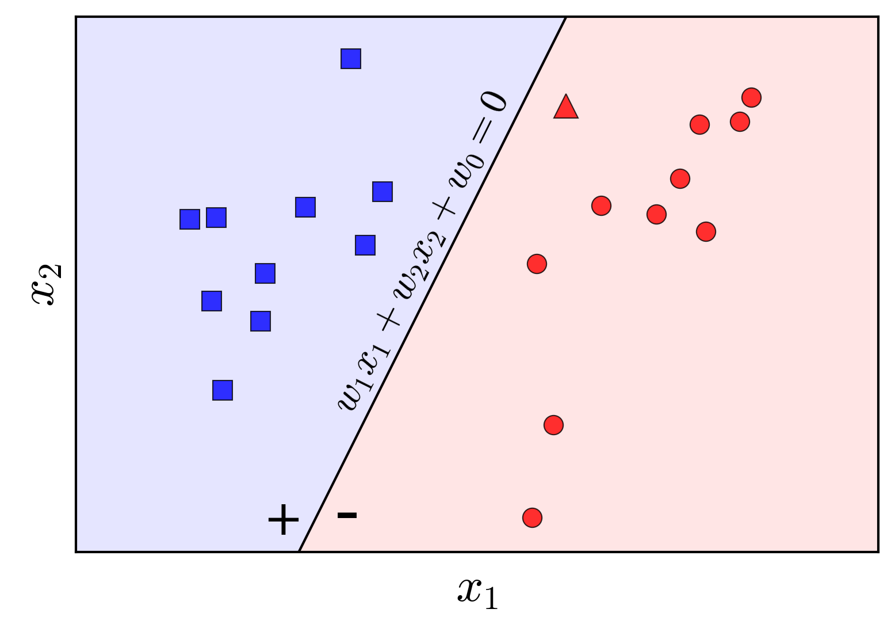

# Bài toán Perceptron

Cho 2 class được gán nhãn, tìm một đường (dữ liệu 2 chiều), một mặt phẳng (dữ liệu 3 chiều) hoặc một siêu phẳng - hyperplane (dữ liệu nhiều chiều), sau đây gọi chung là đường phẳng, để chia toàn bộ các điểm dữ liệu thuộc class 1 về một phía và toàn bộ các điểm dữ liệu thuộc class 2 về một phía. Giả định rằng tồn tại một đường phẳng như thế.

# Thuật toán PLA - Perceptron Learning Algorithm

## Tổng quan

Giả sử các điểm dữ liệu $(\textbf{x}^{(1)}, \textbf{x}^{(2)}, ..., \textbf{x}^{(m)})$ thuộc một không gian N chiều: $\textbf{x}^{(i)} \in \mathbb{R}^{n}$ và được gán nhãn $y^{(i)}$ bằng 1 hoặc -1.

Đường phẳng chia các điểm dữ liệu này thành các vùng cùng nhãn sẽ có dạng như sau:

$$
w_0+w_1x_1+w_2x_2+...+w_nx_n=0\\
\textbf{w}^T\underline{\textbf{x}}=0
$$

với $\underline{\textbf{x}}$ là vector mở rộng của điểm dữ liệu bằng cách thêm phần tử $x_0=1$ lên trước vector $\textbf{x}$. Và từ đây, khi nói $\textbf{x}$, cũng ngầm hiểu là vector mở rộng.

Bởi vì đường phẳng này có tính chất: tất cả các điểm dữ liệu thuộc cùng phía so với đường phẳng này sẽ có giá trị hàm số: $f(\textbf{x})=w_0+w_1x_1+w_2x_2+...+w_nx_n$ cùng dấu với nhau.
Do đó, nếu ta có ràng buộc:

$$
\begin{cases}
f(\textbf{x}^{(i)}) \ge 0 \Leftrightarrow y^{(i)}=1 \\
f(\textbf{x}^{(i)}) \lt 0 \Leftrightarrow {y}^{(i)}=-1\\
\end{cases}
\quad hoặc \quad sgn(f(\textbf{x}^{(i)}))=y^{(i)}
$$

thì bài toán trở thành tìm một bộ số $\textbf{w}^T=(w_0, w_1, ..., w_n)$ thỏa mãn ràng buộc trên.

Ví dụ: Đối với các điểm dữ liệu thuộc không gian 2 chiều ta có hình sau  

Ta có thể đưa bài toán này về dạng bài toán tối ưu sao cho số trường hợp vi phạm ràng buộc là nhỏ nhất (bằng 0):

$$
J'(\textbf{w})= \min_{\textbf{w}} \sum_{i \in \mathcal{M}}-y^{(i)} \cdot sgn(\textbf{w}^T\textbf{x}^{(i)}) 
$$

$\mathcal{M}$ là tập hợp các điểm dữ liệu bị phân loại sai, nghĩa là các điểm dữ liệu có $y^{(i)} \ne sgn(\textbf{w}^T \textbf{x}^{(i)})$ khi đó $-y^{(i)} \cdot sgn(\textbf{w}^T\textbf{x}^{(i)})=1$. Và hàm số $J'(\textbf{w})$ như là một hàm, đếm số trường hợp phân loại sai. Tuy nhiên, có thể thấy đây là hàm rời rạc, không tính được đạo hàm theo $\textbf{w}$ nên rất khó tối ưu. Chúng ta cần tìm một hàm khác để việc tối ưu khả thi hơn:

$$
J(\textbf{w})= \min_{\textbf{w}} \sum_{i \in \mathcal{M}}-y^{(i)}\textbf{w}^T\textbf{x}^{(i)}
$$

Khi $i \in \mathcal{M}$ tức là $\textbf{x}^{(i)}$ bị phân loại sai thì tích $-y^{(i)}\textbf{w}^T\textbf{x}^{(i)}$ luôn lớn hơn 0 (nếu $\textbf{w}^T\textbf{x}^{(i)}=0$ sẽ cộng thêm với một số nhỏ bất kỳ $\lambda$), giá trị này càng gần lớn nghĩa là sự sai lệch càng lớn. Giá trị nhỏ nhất của $J'(\textbf{w})$ là 0 và chỉ đạt được khi không còn trường hợp nào phân loại sai.

Tại một thời điểm, nếu chúng ta chỉ quan tâm tới các điểm dữ liệu bị phân loại sai (vi phạm ràng buộc) thì hàm số $J(\textbf{w})$ khả vi theo $\textbf{w}$ nên chúng ta có thể sử dụng kỹ thuật Gradient Descent để tối ưu hàm này. Cụ thể, với mỗi điểm dữ liệu $\textbf{x}^{(i)}$ bị phân loại sai ta có $J(\textbf{w}; \textbf{x}^{(i)}; y^{(i)}) = -y^{(i)}\textbf{w}^T\textbf{x}^{(i)}$, đạo hàm tương ứng $\nabla_\textbf{w}J(\textbf{w}; \textbf{x}^{(i)}; y^{(i)})=-y^{(i)}\textbf{x}^{(i)}$. Vậy quy tắc cập nhật là:

$$
\textbf{w} = \textbf{w} + \lambda y^{(i)}\textbf{x}^{(i)}
$$

với $\lambda$ là tham số học learning rate

## Các bước thực hiện

1. Chọn ngẫu nhiên một vector hệ số $\textbf{w}$ với các phần tử gần bằng 0
2. Duyệt qua các điểm dữ liệu $\textbf{x}^{(i)}$:
   - Nếu điểm dữ liệu được phân loại đúng $y^{(i)}=sgn(\textbf{w}^T\textbf{x}^{(i)})$ thì không làm gì
   - Nếu điểm dữ liệu bị phân loại sai, cập nhật vector tham số theo công thức: $\textbf{w} = \textbf{w} + \lambda y^{(i)}\textbf{x}^{(i)}$
3. Kiểm tra xem còn điểm dữ liệu nào bị phân loại sai không, nếu có thì tiếp tục bước 2, nếu không thì dừng thuật toán

## Nhận xét

Perceptron là mô hình neuron network đầu tiên tuy nhiên còn rất đơn giản và không linh hoạt:

  1. Không giải được nếu các điểm dữ liệu không chia tuyến tính được
  2. Có thể có vô số nghiệm khác nhau (Cần tìm đường phẳng nào là "tốt" nhất)
  3. Do phải duyệt các điểm dữ liệu để xem điểm này có bị phân loại sai hay không rồi mới thực thi tính hàm mất mát và cập nhật tham số $\textbf{w}$ không tận dụng được việc vectorize trong quá trình tính toán.

(1) Biến thể khác là Pocket PLA dành cho những bộ dữ liệu không chia tuyến tính được, khi đó thuật toán này cố gắng tối thiểu số điểm bị phân loại sai (luôn $\gt 0$)

(2) Có thể sử dụng SVM

(3) Có thể đưa bài toán về dạng khác để sử dụng nhân ma trận: $y^{(i)} \in \{0, 1\}$ và hàm kích hoạt:

$$
g(z^{(i)})=
\begin{cases}
1 \quad if \quad z^{(i)} \ge 0\\
0 \quad if \quad z^{(i)} \lt 0
\end{cases}
$$

trong đó $z^{(i)}=\textbf{w}^T\textbf{x}^{(i)}$, hàm mất mát $\mathcal{L}(y^{(i)}, \hat{y}^{(i)}) = (y^{(i)} - \hat{y}^{(i)})^2$, hàm giá trị (cost function):

$$
J(\textbf{w}) = \frac{1}{2m}\sum_{i=1}^{m}(y^{(i)} - g(\textbf{w}^T\textbf{x}^{(i)}))^2 \quad with \quad \hat{y}^{(i)}=g(\textbf{w}^T\textbf{x}^{(i)})
$$

Hàm này đóng vai trò đếm số lượng điểm dữ liệu bị phân loại sai, tuy nhiên để có công thức giống Mean Square Error, chúng ta chia cho 2m, khi tìm cực tiểu của hàm này cũng là tìm cực tiểu của số điểm dữ liệu bị phân loại sai.
Gradient $\nabla_\textbf{w}J(\textbf{w}; \textbf{x}^{(i)}; y^{(i)})=\textbf{x}^{(i)}(\hat{y}^{(i)} - y^{(i)})$ suy ra để tìm cực tiểu của $J(\textbf{w})$ ta sẽ sử dụng Gradient Descent:

$$
\textbf{w} = \textbf{w} - \lambda\frac{1}{m}\sum_{i=1}^{m}\textbf{x}^{(i)}(\hat{y}^{(i)} - y^{(i)})
$$

với $\lambda$ là tham số học learning rate.
