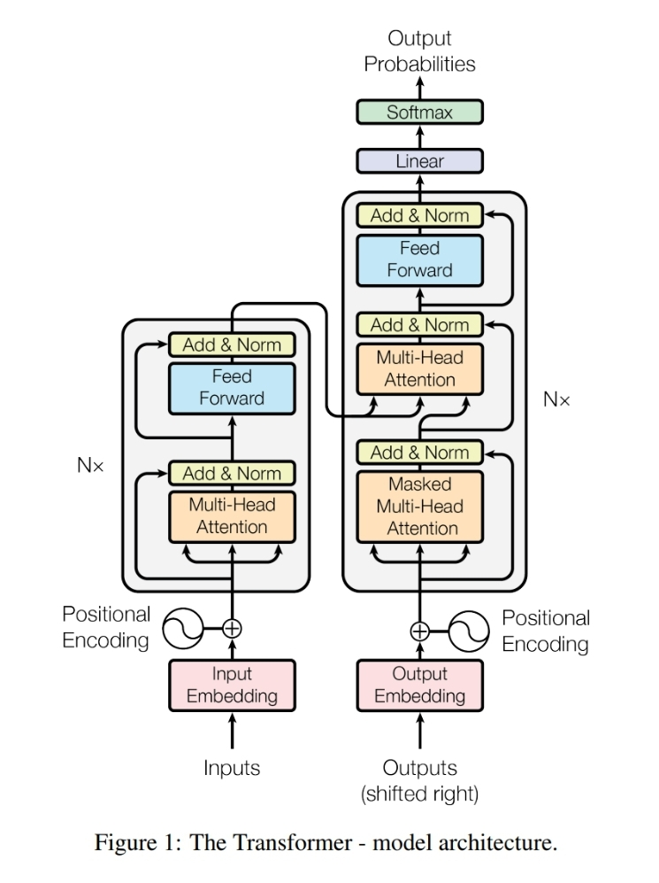
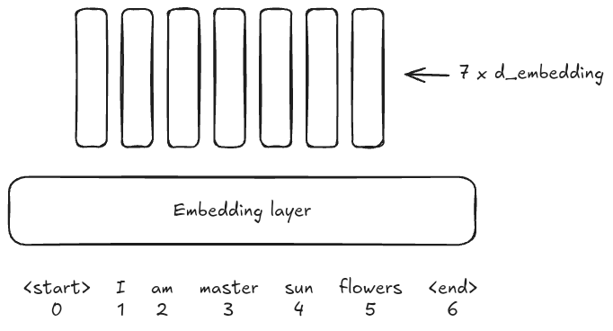
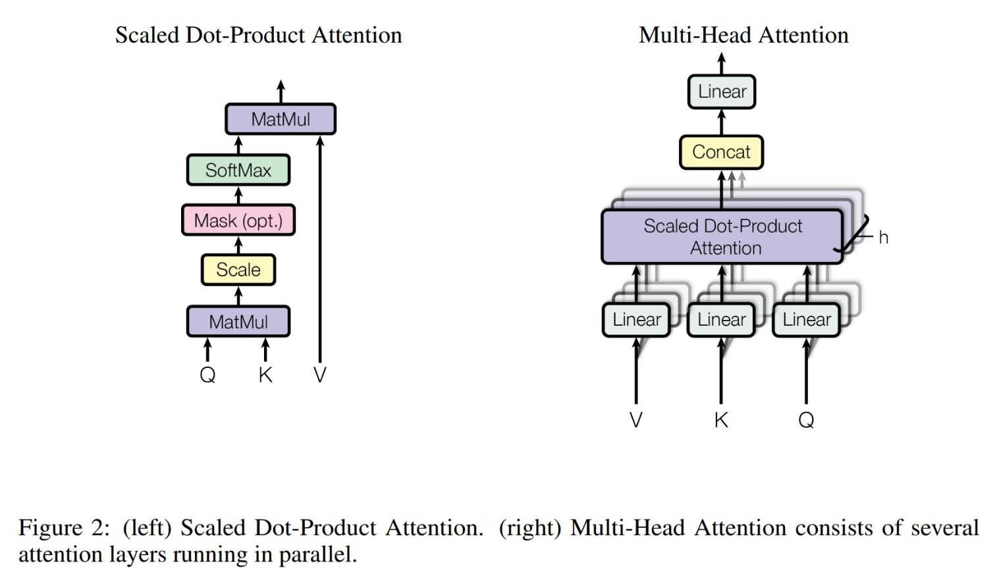

# Introduction

Transformers is a deep learning architecture introduced in the paper "Attention Is All You Need", which is written by Google Research team. This architecture is the core of various improvements in both Natural Language Processing and Computer Vision.

# Overview

In the original paper, Transformers include two main components. The first component consists of 6 encoders stacked together. And the second includes 6 decoders.

# Architecture

## Embedding layer

Input will go through an embedding layer first in both encoder and decoder

## Position encoding

Assume input includes 7 tokens like above image, we have position encoding will be a matrix with size 7 * `d_embedding`  in which, each row will be encoding of token's position.

$$
PE(pos, 2i) = sin(pos / 10000^{2i/d_{embedding}})
$$

$$
PE(pos, 2i+1) = cos(pos/10000^{2i/d_{embedding}})
$$

 In which, `i` takes a integer value from `0` to `d_embedding / 2`

For example, with `pos = 0` , `d_embedding = 512` , we have:

$$
PE(0, 0) = sin(0 / 10000^0) = 0 \\
PE(0, 1) = cos (0 / 10000^0) = 1 \\
PE(0, 2) = sin(0 / 10000^{2/512}) = 0 \\
...
$$

The encoded vector for row 0 will be `[0, 1, 0, 1, …, 0, 1]`

## Encoder layer

Encoder includes Multi-Head Attention Layer (in the original paper it is 8 heads), after that is a Add and Norm Layer which contain a residual connection and a normalization function. After is a Position-wise Fully Connected Feed-forward Network.

## Decoder layer

Decoder is quite same as encoder except that it contain a Masked-Multi-Head Attention Layer at the beginning.

# How it works

Now, we need to deep dive in how this architecture actually work in training and inference phase. The architecture in the originial paper is optimized for machine translation task, so, I assume the task is translate sentences from English to Vietnamese.

## Training phase

For a training sample with input is “I am mastersunflowers” and the expected output is “Toi la bac thay hoa huong duong”. For simplicity, assume tokenizer will tokenize sentence as follow: “<start>”,  “I",  “am",  “master", “sun", “flowers", “<end>” and “<SOS>”, “Toi", “la", “bac", “thay", “hoa", “huong”, “duong", “<EOS>”.

### What happens in encoder?

The input, as introduced at Embedding Layer part, will be embedding into a 7 *`d_embedding` matrix, then the input also through Position Encoding layer, which produce also a 7* `d_embedding` matrix, each row will contains a value that can represent the postion of input token.

I will annotate the input is `X`, the embedding `X` is `X_e`, the postion is `X_p`, so, the matrix to push into first sub-layer of encoder is

$$
X_t = X_e + X_p
$$

And then we have:

$$
K = X_t * W_k \\
Q = X_t * W_q \\
V = X_t * W_v \\
$$

`W_k` is a matrix with dimension `d_embedding * d_k`

`W_q` is a matrix with dimension `d_embedding * d_q`

`W_v` is a matrix with dimension `d_embedding * d_v`

`d_k` need to equal `d_q`

In the paper, because of residual connection, the output of Multi-Head Attention Layer must have equal dimension of the `X_t` which have `num_tokens * d_embedding` so, we have `d_q = d_k = d_v = d_embedding / num_heads` .

For more accurate and shortage, I will call the dimension of intermediate matrix in the encoder is `d_model` because `d_model` can different than `d_embedding` among architectures but in this case `d_model` need to equal `d_embedding` because of residual connection.

Each head in Multi-Heads Attention Layer have the same functionality, which will forward input (K, Q, V) as:

$$
    Attention(K, Q, V) = softmax(\frac{QK^T}{\sqrt{d_k}})V
$$
